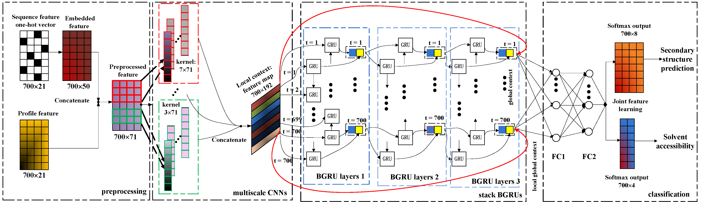

# IJCAI2016

This repository is for the replication of our published paper [Protein Secondary Structure Prediction Using Cascaded Convolutional and Recurrent Neural Networks](https://www.ijcai.org/Proceedings/16/Papers/364.pdf) on IJCAI2016. Our whole pipeline is listed as follows.
<p align="center"></p>

Please consult and consider citing the following papers:

# Download data

For cb513+profile_split1.npy.gz, cullpdb+profile_6133.npy.gz, cullpdb+profile_6133_filtered.npy.gz, please download from this [website](http://www.princeton.edu/~jzthree/datasets/ICML2014/)
For CASP10 and CASP11, please download from this [website](https://goo.gl/tjJttR)
Download data and put them in ./data folder

# Project Settings

1. Install the requirements (you can use pip or [Anaconda](https://www.continuum.io/downloads)):

    ```
    conda install pip h5py cython numpy scipy
    conda install -c conda-forge theano 
    conda install -c toli lasagne
    ```

2. You can do training/validation/test through this IPython notebook ./Train_validation_test_release.ipynb

## Acknowledgement

We thank [Jian Zhou](http://www.princeton.edu/~jzthree/) and [Sheng Wang](http://ttic.uchicago.edu/~wangsheng/) for CASP dataset generation.

## Reference

@inproceedings{li2016protein,
  title={Protein secondary structure prediction using cascaded convolutional and recurrent neural networks},
  author={Li, Zhen and Yu, Yizhou},
  booktitle={Proceedings of the Twenty-Fifth International Joint Conference on Artificial Intelligence},
  pages={2560--2567},
  year={2016},
  organization={AAAI Press}
}


